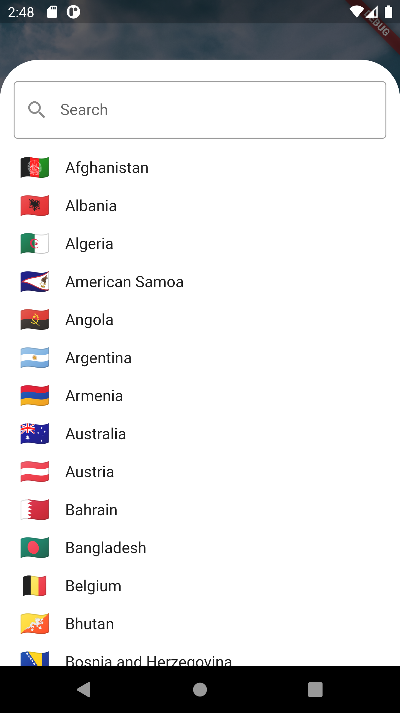

# World Time

## About

_World Time App_ allows you to see the currrent Time of any place arround the world. It has a collection of aver 200 Countries which you can browse. Also the background image reflects day or night time at the selected location.

Simply tap on change location button to change the location.

## Getting Started

This project is a starting point for a Flutter application.

A few resources to get you started if this is your first Flutter project:

- [Lab: Write your first Flutter app](https://flutter.dev/docs/get-started/codelab)
- [Cookbook: Useful Flutter samples](https://flutter.dev/docs/cookbook)

For help getting started with Flutter, view our
[online documentation](https://flutter.dev/docs), which offers tutorials,
samples, guidance on mobile development, and a full API reference.

## To Download apk

[https://github.com/sabasaeed/world-time/raw/master/app-release.apk] (Click Here)
Download will start automatically

## Screen Shots

